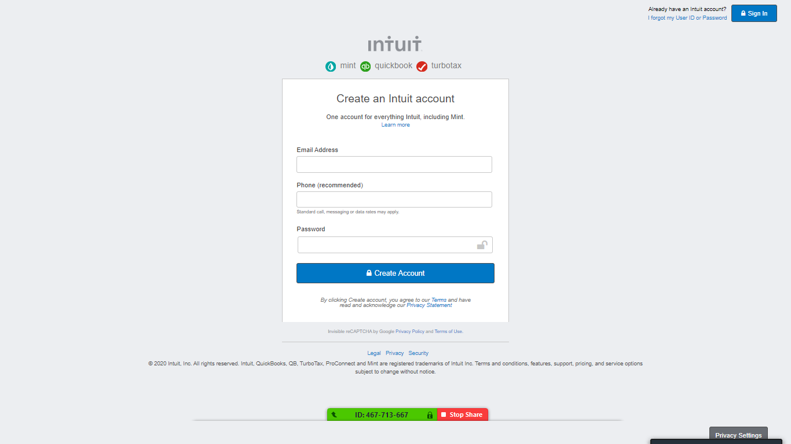

# mint.com signup page replica

Clone of [mint.com signup page](https://accounts.intuit.com/signup.html?offering_id=Intuit.ifs.mint&namespace_id=50000026&redirect_url=https%3A%2F%2Fmint.intuit.com%2Foverview.event%3Futm_medium%3Ddirect%26cta%3Dhero_sign_up_free_ProspectWeb%26ivid%3D4e3573c4-8bf1-4035-a7f3-4838ad0ed57e%26adobe_mc%3DMCMID%253D41857442784418137370889927368379101233%257CMCORGID%253D969430F0543F253D0A4C98C6%252540AdobeOrg%257CTS%253D1585469032%26ivid%3D4e3573c4-8bf1-4035-a7f3-4838ad0ed57e#) for our Second Microverse project included in the HTML & CSS course. 

## Built With

- HTML
- CSS

## Live Demo

[Live Demo Link](https://vanheaven-ui.github.io/signup-page)

## Getting Started

To get a local copy up and running follow these simple example steps.
 - Clone or download this repository to your local workstation.

### Prerequisites
there are no prerequisits to run the project. but if you want to work on it make sure you have the following installed in your global evnviroment
  - [npm](https://www.npmjs.com/products/teams?utm_source=adwords&utm_medium=ppc&utm_campaign=npmTeams2019Q2&utm_content=site&gclid=Cj0KCQjwyPbzBRDsARIsAFh15JaJyPdeb-Q11Rq-LMaulSWINd6PYdJQ2OkZyE75reyBcpnnmwPrgRoaAv_5EALw_wcB)
  - [npx](https://www.npmjs.com/package/npx)
### Install

for development make sure you run the following command before you start working on the project
`npm install`
this will install all the packages used for development purpose, mainly `stylint`

### Usage
 enter the directory where you cloned or downloaded the project and open index.html file using your favorite browser
 
## Authors

👤 **Mikael Araya**

- Github: [@mikearaya](https://github.com/mikearaya)
- Twitter: [@mikearaya12](https://twitter.com/mikearaya12)
- Linkedin: [linkedin](https://linkedin.com/in/mikael-araya)

👤 **Mworekwa Ezekiel**

- Github: [@vanheaven-ui](https://github.com/vanheaven-ui)
- Twitter: [@MworekwaE](https://twitter.com/MworekwaE)
- Linkedin: [linkedin](www.linkedin.com/in/vanheaven)

## 🤝 Contributing

Contributions, issues and feature requests are welcome!

Feel free to check the [issues page](issues/).

## Show your support

Give a ⭐️ if you like this project!

## Acknowledgments

- Hat tip to anyone whose code was used
- Inspiration
- etc

## 📝 License

This project is [MIT](lic.url) licensed.
